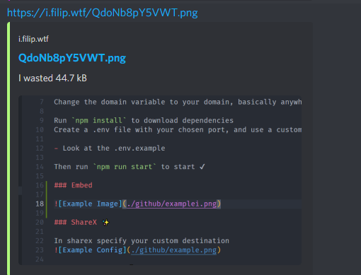

# SharexJs 😭

Sharex file uploader handler written in js

## Usage 🔥

Change the domain variable to your domain, basically anywhere it says localhost

Run `npm install` to download dependencies  
Create a .env file with your chosen port, and use a custom key 🔐

- Look at the .env.example

Then run `npm run start` to start ✔

### Embed

### ShareX ✨

In sharex specify your custom destination

### nginx config 😳

This is a basic config you can obviously change it (eg serve files directly from nginx)
I recommend you actually read a tutorial for nginx. For example:

- [Setup Nginx on ubuntu](https://www.digitalocean.com/community/tutorials/how-to-install-nginx-on-ubuntu-20-0)
- [Setup nodejs + nginx](https://www.digitalocean.com/community/questions/how-to-run-node-js-server-with-nginx)
- [Free https](https://letsencrypt.org/)

